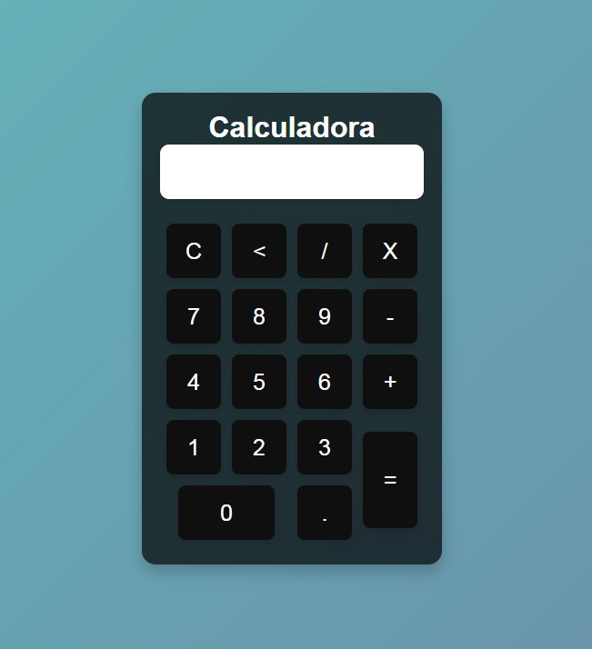

# Calculadora Simples em JavaScript com Testes usando Cypress

Este projeto consiste em uma calculadora simples implementada em JavaScript, HTML e CSS, acompanhada por testes automatizados usando Cypress como parte da integração contínua (CI).

# Como Usar a Calculadora
Clone este repositório:

bash
Copy code
git clone https://github.com/seu-usuario/seu-repositorio.git
Abra o arquivo index.html em um navegador web para visualizar a calculadora.

Execute a aplicação localmente usando um servidor web ou carregue o arquivo index.html em um navegador.

Funcionalidades
Adição
Subtração
Multiplicação
Divisão
Operações com decimais
Limpar visor (C)
Apagar último caractere
Testes Automatizados com Cypress
O projeto inclui testes automatizados usando Cypress para garantir o funcionamento correto da calculadora.

# Configuração do Cypress
Instale o Cypress globalmente:

bash
Copy code
npm install -g cypress
No diretório do projeto, execute o seguinte comando para abrir a interface do Cypress:

bash
Copy code
cypress open
Execute os testes interativos ou automáticos conforme necessário.

# Integração Contínua (CI) com Cypress
Este projeto está integrado a um serviço de CI, com o GitHub Actions.

Contribuições
Contribuições são bem-vindas! Sinta-se à vontade para abrir problemas (issues) ou enviar solicitações de pull (pull requests).